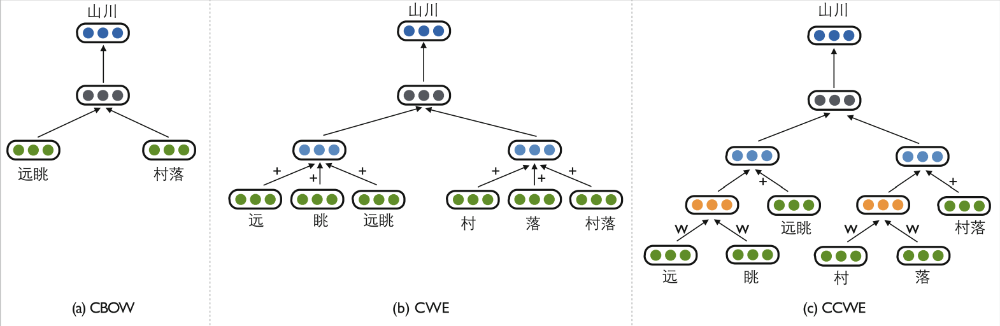
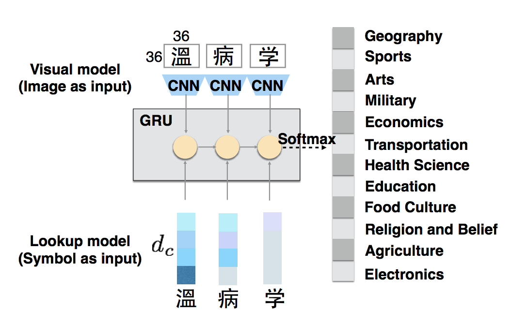
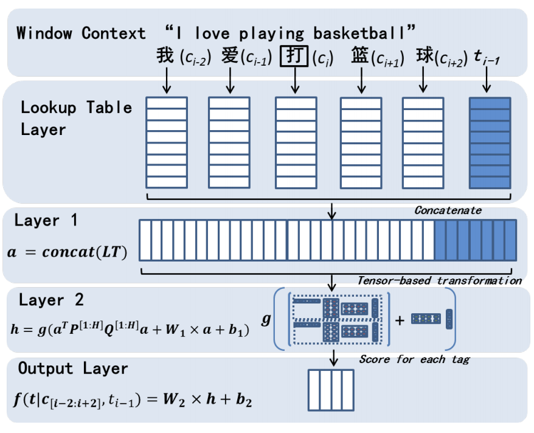

_20170928_

#### Original Hypotheses

- We can avoid maintaining a dictionary by man power
- We can catch more out-of-vocabulary words
- Chinese in character unit can have meanings
- We can find out valid 2-character words from frequency information

#### Related work

1. Morpheme & character-based word embeddings
    - English
        - __Better Word Representations with Recursive Neural Networks for Morphology__, CoNLL 2013
        - __Compositional Morphology for Word Representations and Language Modelling__, ICML 2014
    - Chinese
        - __Joint Learning of Character and Word Embeddings__, IJCAI 2015
            - Internal characters + external contexts (`CWE`)
        - __Improved Learning of Chinese Word Embeddings with Semantic Knowledge__, CCL 2015 & NLP-NABD 2015
            - New composition functions using the semantic relations between characters (instead of addition) (`CCWE`)  
            { width=50% }
        - __Learning Character-level Compositionality with Visual Features__, ACL 2017
            - Adding shape of characters as feature  
            { width=50% }
2. Chinese segmentation
    - Summery
        - Purely dictionary-based
        - Purely statistical approach
        - Statistical dictionary-based
        - Supervised machine-learning
        - Neural network models
    - Papers
        - __Chinese Word Segmentation as Character Tagging__, IJCLCLP 2003
        - __HHMM-based Chinese lexical analyzer ICTCLAS__, SIGHAN 2003
        - __Chinese Segmentation and New Word Detection using Conditional Random Fields__, COLING 2004
            - Statistical sequence modeling framework
        - __Character-Level Dependencies in Chinese: Usefulness and Learning__, EACL 2009
            - Character-level dependency can be a good alternative to word boundary representation for Chinese
        - __Parsing the Internal Structure of Words: A New Paradigm for Chinese Word Segmentation__, HLT 2011
        - __Chinese Parsing Exploiting Characters__, ACL 2013
            - Parsing character-level syntax trees for jointly performing word segmentation, POS tagging & parsing, using a CKY-style or shift-reduce algorithm
        - __Max-Margin Tensor Neural Network for Chinese Word Segmentation__, ACL 2014
            - Explicitly models the interactions between tags & context characters by exploiting tag embeddings and tensor-based transformation (`MMTNN`)  
            { width=50% }
        - __Segmentation-Free Word Embedding for Unsegmented Languages__, EMNLP 2017
            - Training word embeddings on __word co-occurrence statistics__ & __frequent character n-grams__

#### Proposed method

1. Train character embeddings
      - Is context-enhanced model still meaningful?
      - Component information, word context, etc.
2. Cluster results
3. Learn word list by counting
4. Build connections between words
5. Observe cluster-to-cluster connections
    - Linguistics knowledge?
    - Not semantically compositional Chinese words?
        - Transliterated words, single-morpheme multi-character word (聯綿詞), entity names, etc.
    - If not exhaustive enough, should we enhance with dictionaries?
6. Apply to Chinese word segmentation
    - Graphical knowledge or statistical knowlege?
    - Sequence labelling 2-tags/4-tags?
  
#### Goals

- Avoid maintaining a dictionary by man power
- Catch more out-of-vocabulary words
- Embedding-based word segmentation
- Linguistic knowledge observation from patterns of distributed character representations

#### Difficulties

- Long studied topic with high-accuracy baselines
- New attempt, feasibility unknown
- Lack of experience
